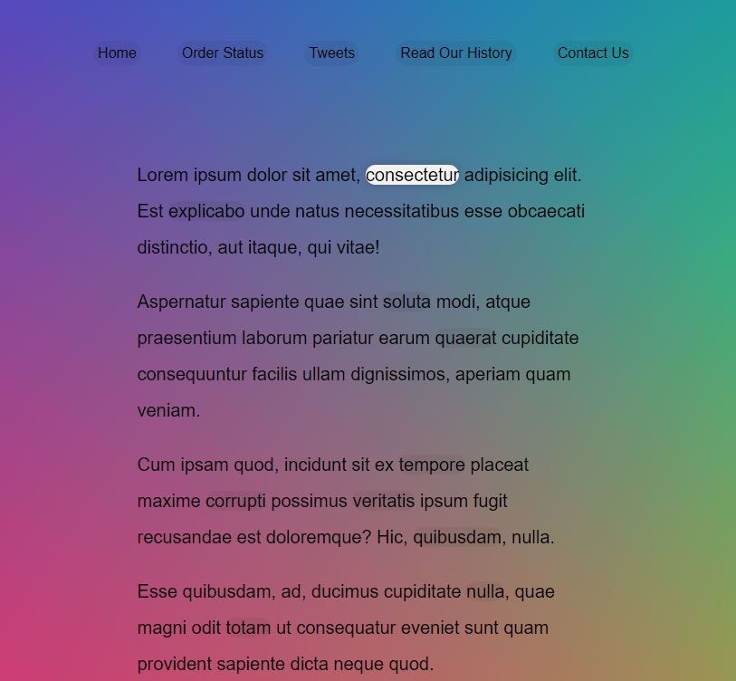

> [Source JavaScript31 click!](https://courses.wesbos.com/account/access/645a66a084b8adbc648ea097/view/194130650)

# DESCRIPTION:

## 01 - JavaScript Drum Kit

## 02 - JS and CSS Clock

## 03 - CSS Variables

## 05 - Flex Panel Gallery

## 06 - Type Ahead

## 07 - Array Cardio

> ex, in the cardio 1

## 08 - Fun with HTML5 Canvas

## 09 - Dev Tools Domination

-- dev tools

## 10 - Hold Shift and Check Checkboxes

## 11 - Custom Video Player

## 12 - Key Sequence Detection

> > special code, hidden, amazing when you find

## 13 - Slide in on Scroll

## 14 - JavaScript References VS Copying

-- any --

## 15 - LocalStorage

## 16 - Mouse Move Shadow

## 18 - Adding Up Times with Reduce

## 19 - Webcam Fun

## 20 - Speech Detection

## 21 - Geolocation

## 22 - Follow Along Link Highlighter

## 23 - Speech Synthesis

## 24 - Sticky Nav

## 26 - Stripe Follow Along Nav

**-- I like to make it --**

## 27 - Click and Drag

**-- I like to make it --**

## 28 - Video Speed Controller

## 29 - Countdown Timer

## 30 - Whack A Mole

THE END
